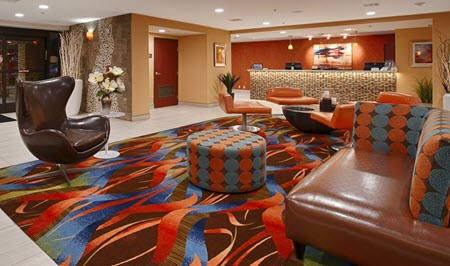
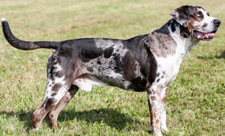
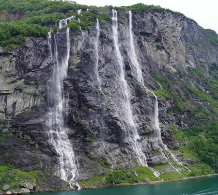

<meta http-equiv="cache-control" content="max-age=0" />
<meta http-equiv="cache-control" content="no-cache" />
<meta http-equiv="expires" content="0" />
<meta http-equiv="expires" content="Tue, 01 Jan 1980 1:00:00 GMT" />
<meta http-equiv="pragma" content="no-cache" />

## SANS SEC487 Reverse Image Lab

Below are images that you need for the SEC487 reverse image search lab. Instructions are in your courseware.

### Carpet

### Dog

### Car

### Landscape

### Church

### Not currently in SANS Institute's OSINT SEC487 class?

Interested in OSINT, reconnaissance, and social media? Yeah. We are too! Check out our course! --- MIcah
