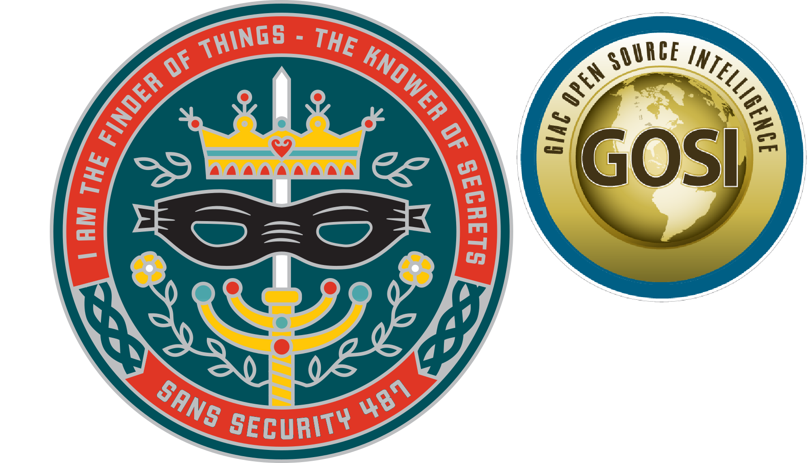

<meta http-equiv="X-UA-Compatible" content="chrome=1">
<meta name="description" content="SANS OSINT SEC487 Start Page used in the Open Source Investigations Training Course">
<meta name="keywords" content="SANS,OSINT,SEC487,open source intelligence,open source,intelligence,socmint,social media intelligence,osint training">

<meta http-equiv="cache-control" content="max-age=0" />
<meta http-equiv="cache-control" content="no-cache" />
<meta http-equiv="expires" content="0" />
<meta http-equiv="expires" content="Tue, 01 Jan 1980 1:00:00 GMT" />
<meta http-equiv="pragma" content="no-cache" />

# Welcome to the site

Here you will find links and content to assist you.

## Bookmarks for you

* <a href="https://sec487.info/startme" target="_blank">SEC487 Course Start.me page</a>
* <a href="http://osintframework.de" target="_blank">OSINT Start.me page by Bruno Mortier</a>
* <a href="https://technisette.com" target="_blank">General OSINT page by Technisette</a>
* <a href="https://github.com/WebBreacher/osinttools" target="_blank">OSINT MindMap Template</a>

{:class="w500"}

## Not currently in the class?

Interested in OSINT, reconnaissance, and social media? Yeah. We are too! Check out our course at <a href="https://www.sans.org/sec487" target="_blank">https://www.sans.org/sec487</a>.

--- MIcah

<!--

    Of course we need to put some fun things here in the HTML comments for those of you that are looking for
    them. Our course uses characters from the iconic, US movie from the 1980s, The Princess Bride.

    Everyone who has watched the movie knows about Inigo Montoya, Dread Pirate Roberts, and Princess Buttercup.
    But few people know the name of the person that was the 'negative cutter' on that movie. Tweet who that was
    to #SEC487 and I'll know that you read these comments.

    Thanks for stopping by the site and I hope to see you, or to have seen you, in the SEC487 class!

    - Micah (@WebBreacher)
-->